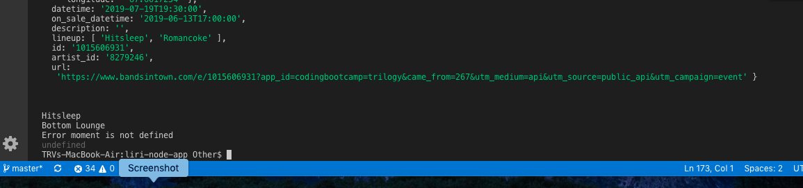
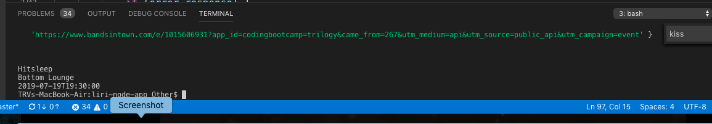
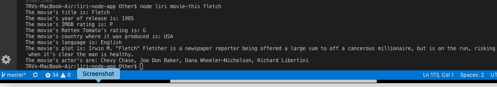
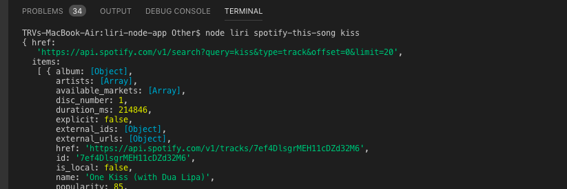
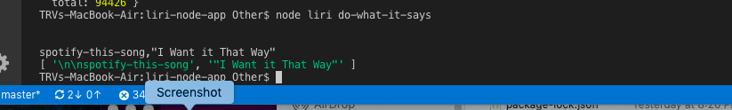

# liri-node-app

LIRI is like iPhone's SIRI. However, while SIRI is a Speech Interpretation and Recognition Interface, LIRI is a Language Interpretation and Recognition Interface. LIRI is a command line node app that takes in parameters and gives you back data.

The user has the option of using four commands (listed below) in conjuntion with specific parameters associated with the commands. The Commands are:

concert-this

spotify-this-song

movie-this

do-what-it-says

